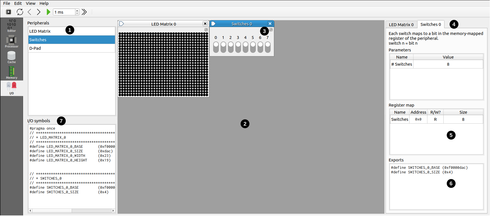

# Memory-mapped I/O devices
As of version 2.2, Ripes includes various memory-mapped I/O devices. Through these, it is possible to quickly realize a small embedded system. The following page gives an overview of the usage of devices, as well as how to create your own.

## Usage
Navigating to the I/O tab, the set of available devices are available at **(1)**. Double-clicking any of these will create the device.  
When a device is created, it is automatically assigned a place in the memory map of the system, and from this, available to be read or written from the processor.

All devices are shown in the **(2)** area. Every device may be _popped-out_ of being fixed to this area, if the button **(3)** is clicked. This allows for navigating to other tabs of the program, if it is needed to view a device and i.e., the executing program, at the same time.

On the right-hand side, an overview of the inner details of each device is shown **(4)**. Some devices may have configuration parameters, such as the number of switches in the *switches* device, or the dimensions of an *LED matrix*. **(5)** shows the register map of the device. Here, each entry lists the registers' address (relative to the base offset of the device), whether the register is read or write only, as well as the bit-width of the register. **(6)** shows the symbols exported by the selected device. At minimum, this contains the base address and size (in bytes) of the device, in the memory map.

The collection of all definitions exported by the currently instantiated devices is shown in **(7)**. These definitions are available for reference in assembly or C-language programs.

To use access the devices:
* **In assembly:** the definitions can be used anywhere where an immediate value is provided.
* **In C**: `#include "ripes_system.h"` in the program, and reference the names like any other `#define` 

## Example
The following example is written in C (see [Building and Executing C programs with Ripes](c_programming.md) for instructions on how to set up the C compiler). For an assembly example, please see `File->Load Example...->Assembly->leds.s`.

First, navigate to the _I/O_ tab and instantiate two devices; an *LED matrix* device and *Switches* device. Select the instantiated _LED matrix_ device and, in the right-hand side _Parameters_ list, adjust the `Height` parameter to 1, `Width` parameter to 8, and increase the LED size. In doing so, notice how the register map as well as the exported symbols from the LED matrix changes.  
Next, navigate to the _editor_ tab and load the `File->Load Example...->C->switchesAndLeds.c` example. In this program, we assign the base addresses of the LED matrix and switches component to variables, which we will use to read- and write from. A bitmask is continuously applied to test each bit in the _switches_ register. If set, the LED at the offset of the toggled switch is written to, in the LED matrix device. Next, press the _build_ button.

> **A note on simulation speed:**  
> When accessing devices, we often want to be able to execute the program as fast as possible, to make device access as interactive as possible. It is therefore recommended to switch to i.e., the single-cycle processor, as well as to reduce the `Max. cache plot cycles` setting, to reduce the overhead from other parts of the simulator.

Navigate to the _I/O_ tab, and press the _Run_ button (), to run the program. Now, when toggling the switches you should see that the corresponding LED lights up in the LED matrix. Try also to just step through the program (F6). Toggle a switch, and you'll notice that the latency between your click and the LED lighting up is substantially larger, due to the reduced clock frequency of the processor.

## Adding new devices
Adding a new device consists mainly of defining the behavior of the device, as well as the visualization for the device. The second part is strictly Qt UI programming, and so will not be explained here.

Any new devices must inherit from the [IOBase](../src/io/iobase.h) class. Please **read this header** as it describes each of the functions made available to you when implementing a new device.
Each device must provide a precise description of its interface, namely, its programmable registers, exported symbols, name, and so forth. For reference, please see the implementation of a current component, i.e., the [IOSwitches](../src/io/ioswitches.cpp) class.

The four most important functions for integrating a device into Ripes are:
* `uint32_t ioRead(uint32_t offset, unsigned size)`: Read access **from** the processor **to** a device, requesting to read the value at address offset 0, reading `size` bytes. I.e., if a device is placed at base address `0xffff0000` and the processor reads a word (4 bytes) from memory position `0xffff0004`, this function will be called as `ioRead(0x4, 4)`, and the device must return the value corresponding to the given offset.
* `void ioWrite(uint32_t offset, uint32_t value, unsigned size)`: Similar as above, but a _write_ access **from** the processor **to** the device.
* `void memWrite(uint32_t address, uint32_t value, uint32_t size)`: A device can itself call this function during execution to write into simulator memory. `address` is an **absolute** address.
* `uint32_t memRead(uint32_t address, uint32_t value)`: Similar as above, but allows a device to **read** a value from simulator memory.

If your peripheral requires to call the Qt widget `update` function, you **must** use `emit scheduleUpdate()` if updating from within an `ioRead` or `ioWrite` call. This is because these functions are called from within the simulator, which runs on another thread, and modifications to the Qt UI must be called from the main thread. By calling `emit scheduleUpdate()`, we ensure that there is a cross-thread signal emitted, for scheduling an update of the component in the Qt event loop.

If you create your own device, do not hesitate to submit a pull request to have it included in the next release of Ripes!
